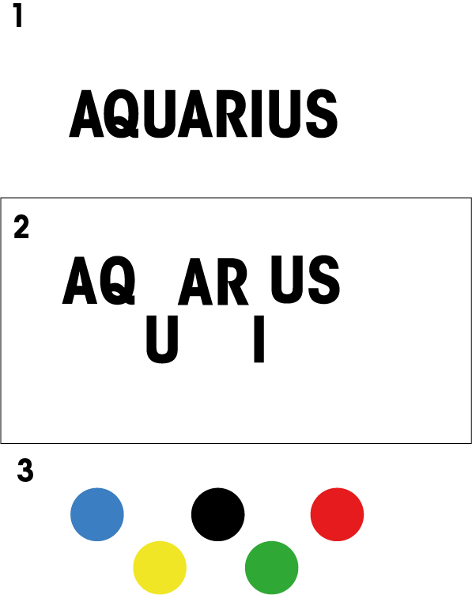

# Procesverslag
**Auteur:** -Bilal Guenaoui-

**De opdrachten:** [opdracht 1](opdracht1/index.html) en [opdracht 2](opdracht2/index.html)

Markdown is een simpele manier om HTML te schrijven.  
Markdown cheat cheet: [Hulp bij het schrijven van Markdown](https://github.com/adam-p/markdown-here/wiki/Markdown-Cheatsheet).

Nb. De standaardstructuur en de spartaanse opmaak van de README.md zijn helemaal prima. Het gaat om de inhoud van je procesverslag. Besteedt de tijd voor pracht en praal aan je website.

Nb. Door *open* toe te voegen aan een *details* element kun je deze standaard open zetten. Fijn om dat steeds voor de relevante stuk(ken) te doen.

## Opdracht 1 plan

  
uitwerken na schetsen idee (voor week 2)

  ### Je storyboard:
  

  ### Je ambitie: 
  Aan deze technieken/punten wil ik werken:
  - punt 1 Ik wil werken aan de animatie before & after
  - punt 2 Ik wil tekst leren bewegen, vervormen, verkleuren, vergoten etc
  - punt 3 Ik wil ook leren mwerken met light and darkmode
 

## Opdracht 1 reflectie

  
uitwerken bij afronden opdracht (voor week 4)

  ### Je uitkomst - karakteristiek screenshot(s):
  
  

  ### Dit ging goed/Heb ik geleerd: 
  Korte omschrijving met plaatje(s)
  
  Het werken met de animaties en precentages daarvan ging erg goed. Ik heb ook veel geleerd bij het maken van costum properties voor tekst grote en kleur. Dit wist ik namelijk voorheen nog niet.

  

  ### Dit was lastig/Is niet gelukt:
  Korte omschrijving met plaatje(s)

  

## Opdracht 2 plan

  
uitwerken na schetsen idee (voor week 5)

  ### Je ontwerp:
  
  

  ### Je ambitie: 
  Aan deze technieken/punten wil ik werken:
  - Ik heb als doel dat ik wil leren hoe ik in ene <ul> <li> kan dragen en dropen in een andere <ul> <li>.
  - Ik heb als tweede doel dat ik wil leren en begrijpen hoe ik niet altijd alles hoef te ontwerpen in illustrator maar dat ik sommige doen ook met code kan doormiddel van CSS. Ook heb ik ervaren dat dit soms nog beter werkt dan met AI
  - Als derde doel wil ik snappen hoe ik de list items ook ergens aan kan toevoegen doormiddel van de plus en min teken.

## Opdracht 2 test

  
uitwerken na testen (week 7)

  ### Bevinding 1:
  Bij mijn <ul> kwamen de gekozen smaken niet te voorschijn. Na een tijdje het zelf geprobeerd op te lossen heb ik de docent om hulp gevraagd.
  
  

  #### oplossing:
  Het bleek dat in de javascript er een linkje misten
  
  

  ### Bevinding 2:
  Wat voor mij ook lastig was was gebruik maken van mediaqeury's. De ijsbeer wilde ik laten veranderen met verschillende scherm grotes. Zo heb je op een klein scherm alleen de ijsbeer hoofd en op groot de scherm de hele ijsbeer.
 
  

  #### oplossing:
Ik riep alleen de <li> aan in de <ul>, maar ik moest eigenlijk de hele <ul> aan roepen zodat de hele afbeelding veranderd
 
  

  ### Bevinding 3:
  Deze week ben ik er achter gekomen dat je op chrome geen muziek automatisch mag afspelen als iemand je website bezoekt. Nu ben ik aan het kijken of ik mijn audio kan koppelen aan een actie zidat die dan afspeeld en je een ijs ijscoman liedje hoort.
  
  
  ### Bevinding 4:
Bij de gekozen smaken	ul:nth-of-type(2) wordt de gekozen smaak een bolletje. Bij die bolletje wordt de afbeelding niet helemaalrond en blijft er een stuk grijs aan de rechter kant. Dit is iets wat ik nog moet zien op te lossen.

 

  
  ### Bevinding 5:
  Na het testen is het mij ook opgevallen dat als er veel smaken worden gekozen in de smaken <ul> dat de smaak bolletjes wat kleinder worden geperst.
  
  
 

## Opdracht 2 reflectie

  
uitwerken bij afronden opdracht (voor week 8)

  ### Je uitkomst - karakteristiek screenshot(s):
  
  

  ### Dit ging goed/Heb ik geleerd: 
 Het hele javascript gedeelte waar bij je met behulp van Sortable kunt drag en droppen was nog helemaal nieuw voor mij. Hier heb ik veel geleerd en snap ik nu eindlijk hoe je kunt drag en droppen en daarmij ook lijsten kunt maken waar je kunt filteren. Ik ben ook zeker van plan om hier in de toekomst verder mee te oefenen.

  

  ### Dit was lastig/Is niet gelukt:
  Het is mij niet gelukt om de audio te koppelen aan een actie zodat de muziek automatisch afspeeld.
  Ook vind ik het nog moeilijk om de gekozen smaken bolletjes in de ijsbak te veranderen en het plaatje 100% over de bolletje te tonen.
  Verder is het mij helaas ook niet gelukt om de gekozen smaken bolletjes te laten verwijderen omdat ik niet wist wat er is javascript na de "pull:" moets komen.

  

